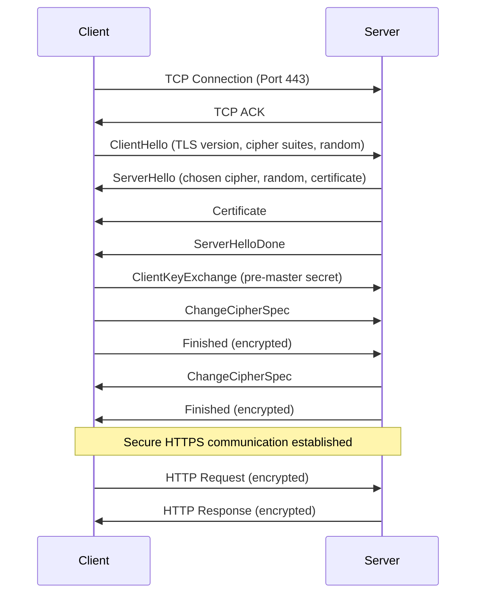
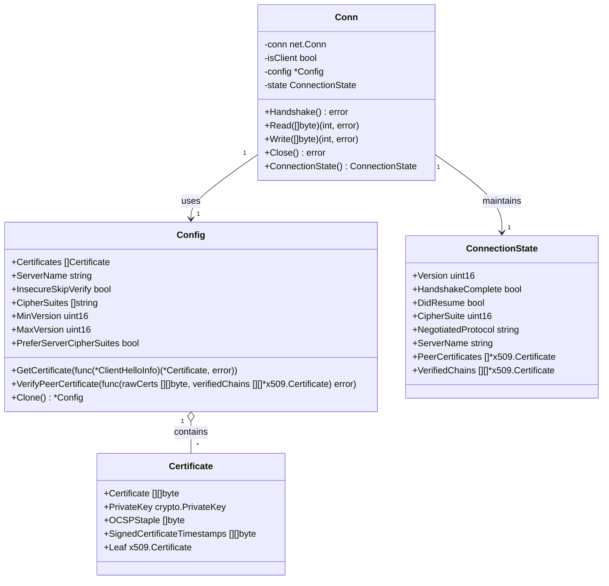

# assignment-1

This is the first assignment in our series. Please review the overview diagram
below before starting.

## Getting Started

Please get familiar with [mermaid](https://mermaid.js.org/intro/) documentation
to understand the diagram syntax used in this assignment.

Here's a sequence diagram that shows the HTTPS connection negotiation process:

Here's a class diagram showing the Go standard library HTTPS session
configuration:

