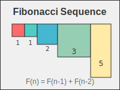

# CS101 - Week 1: Fibonacci Sequence

## Course Information

- **Course**: CS101 - Introduction to Computer Science
- **Week**: 1
- **Topic**: Mathematical Sequences and Recursion

## Assignment Overview

Implement the Fibonacci sequence using multiple approaches to understand
different programming paradigms.

## Learning Objectives

- Understand mathematical sequences in programming
- Compare iterative vs recursive solutions
- Analyze time and space complexity
- Practice debugging and testing

## Requirements

1. Implement Fibonacci using iteration
2. Implement Fibonacci using recursion
3. Implement Fibonacci using memoization
4. Compare performance of all three approaches
5. Create visualizations showing the differences

## Deliverables

- `fibonacci_iterative.py` - Iterative implementation
- `fibonacci_recursive.py` - Recursive implementation
- `fibonacci_memoized.py` - Memoized implementation
- `performance_analysis.py` - Benchmarking code
- `results.md` - Performance comparison report

## Testing Requirements

- Test with inputs: 0, 1, 5, 10, 20, 35
- Measure execution time for each approach
- Document memory usage patterns

## Bonus Challenges

- Implement using matrix exponentiation
- Create a web interface for the calculator
- Add input validation and error handling

## Grading Rubric

- Correctness: 40%
- Performance analysis: 30%
- Code quality: 20%
- Documentation: 10%
