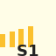

# CS101 - Week 2: Sorting Algorithms

## Assignment Overview

Implement and analyze different sorting algorithms. The visualization below
shows the expected behavior:

## Learning Objectives

- Understand different sorting approaches
- Analyze time and space complexity
- Implement bubble sort, merge sort, and quicksort

## Requirements

1. Implement all three sorting algorithms
2. Create performance benchmarks
3. Document your findings

The visualization above demonstrates how the sorting process should work.

## Course Information

- **Course**: CS101 - Introduction to Computer Science
- **Week**: 2
- **Topic**: Sorting Algorithms and Analysis

## Assignment Overview

Implement and analyze various sorting algorithms to understand their trade-offs
and use cases.

## Learning Objectives

- Understand fundamental sorting algorithms
- Analyze time and space complexity
- Practice algorithm implementation
- Compare algorithm performance

## Requirements

1. Implement bubble sort, selection sort, insertion sort
2. Implement merge sort and quick sort
3. Create a sorting algorithm comparison tool
4. Generate performance graphs and analysis
5. Test with various data sets (sorted, reverse, random)

## Deliverables

- `sorting_algorithms.py` - All algorithm implementations
- `performance_tester.py` - Benchmarking suite
- `data_generator.py` - Test data creation
- `analysis_report.md` - Detailed performance analysis
- `graphs/` - Performance visualization plots

## Test Data Requirements

- Arrays of sizes: 100, 1000, 5000, 10000
- Data types: random, sorted, reverse sorted, partially sorted
- Include duplicate elements testing

## Analysis Questions

1. Which algorithm performs best on nearly sorted data?
2. How does input size affect performance?
3. When would you choose each algorithm?
4. What is the practical impact of stability?

## Grading Rubric

- Implementation correctness: 35%
- Performance analysis: 25%
- Data visualization: 20%
- Report quality: 20%
